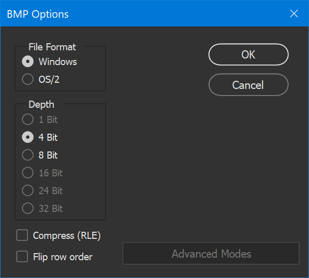
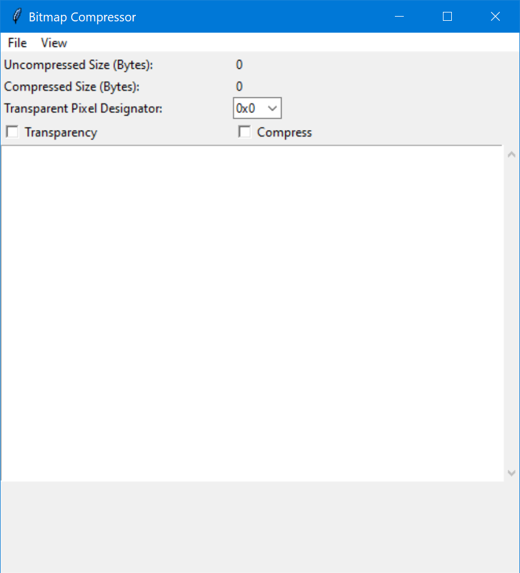
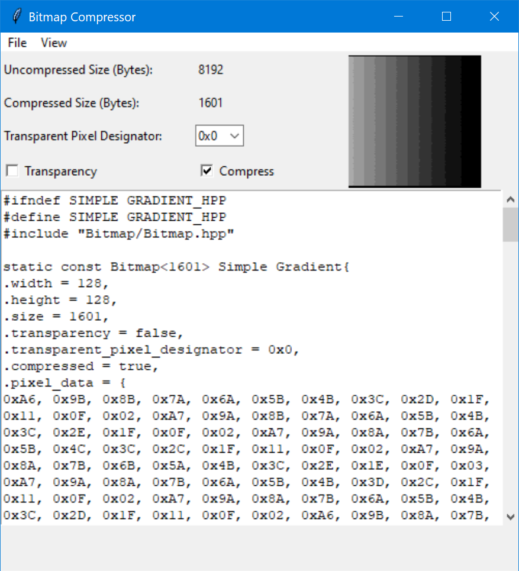
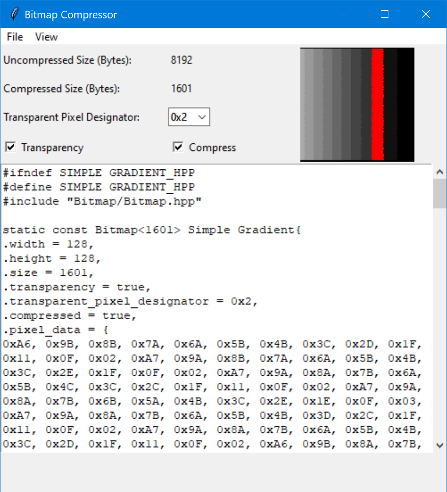

# 4Bit-Grayscale-Compression
 

Take your 4 bit per pixel grayscale OLED bitmaps and compress them to a more reasonable size, add transparency, and generate a header file automatically with fast decompression and easy microcontroller usage.

- [4Bit-Grayscale-Compression](#4bit-grayscale-compression)
    - [This library is designed to work with 128x128 SSD1327 OLED displays but could be adapted quite easily to other displays](#this-library-is-designed-to-work-with-128x128-ssd1327-oled-displays-but-could-be-adapted-quite-easily-to-other-displays)
  - [Tested systems](#tested-systems)
  - [How to use](#how-to-use)
  - [C++ Files](#c-files)
      - [Note that this library leverages C++ features such as std::array and templates](#note-that-this-library-leverages-c-features-such-as-stdarray-and-templates)
    - [Python Libraries Used](#python-libraries-used)
  - [License](#license)

### This library is designed to work with 128x128 SSD1327 OLED displays but could be adapted quite easily to other displays
## Tested systems
- Windows 10 Version 10.0
- macOS Big Sur Version 11.4

*Note that the macOS version must be run from source, a single file will hopefully be released soon*

## How to use
1. Preparing your bitmap
   1. Create your bitmap image in your favorite image editing tool (this will be in Adobe Photoshop but there should be similar options in other tools)
   2. When saving the file, be sure to choose the .bmp file format and 4 bit pixel depth 
      1. *Note: Do not choose to compress it when saving! Compressing it now has no real benefit*
2. Compressing the bitmap
   1. Download the latest release from the release section
   2. Open the program and it should come up with a GUI that looks similar to this 
   3. Go to File ► Open and find the bitmap you saved earlier
   4. The program will now read your file in and a preview of it should show up in the top right 
      1. *Note: The compress checkbox will automatically be selected if your bitmap data is smaller when compressed (if compressed size < uncompressed size)
   5. You should also see a preview of what the header file will look like below the bitmap and data
   6. You can now File ► Save As if there is no transparency in your image, otherwise proceed to the next part
3. Working with transparency
   1. Transparent pixels are defined as any pixel which should not be drawn, meaning the bitmap will use whatever value is already in the pixel buffer at that location
   2. By selecting the transparency checkbox, transparency is enabled, and a transparent pixel designator can be selected via the drop down box
   3. The pixels which will be transparent will show in the preview as red, updated whenever a setting is changed, similar to this 
   4. In order to have transparency, one pixel value (`0x0-0xF`) must be designated to not be drawn and instead represent all transparent pixels. To make this as flexible as possible, it is not a fixed value and can be different for every bitmap
4. Decompressing
   1. Use the `void Decompress(uint8_t x, uint8_t y, bitmap_instance bitmap)` method to decompress the data directly into a pixel buffer
   2. x and y represent the coordinates you want to draw (from top left corner) and bitmap is the name of the bitmap being decompressed
   3. You can also use the `void Decompress(bitmap_instance bitmap)` when decompressing a full screen bitmap which is much faster but only works when dealing with images that are the exact size of the screen drawn at (0,0)
   4. *Note: Unlike traditional bitmap image drawing methods, this one does not require the width, height, or any other data about the bitmap, it is all stored in the struct*
    
## C++ Files
#### Note that this library leverages C++ features such as std::array and templates
1. CPPDecompressionMethods.hpp
   1. This file contains all the methods that are required for doing the decompression, copy the free function out of this file into your implementation
   2. The `Pixel` method will need to be adapted for the graphics library you are using, and if you want to use the full screen decompression `void Decompress(bitmap_instance bitmap)` you will need to change `pixel_buffer` to whatever the name of your pixel buffer array is
2. Bitmap.hpp
   1. This is the base struct for which all bitmap structs are derived from, providing a consistent interface and strong type checking of the data

*Examples for using are planned to be added in the future*

### Python Libraries Used
Refer to the requirement.txt document for library information when working from source.

## License
[Apache-2.0](https://choosealicense.com/licenses/apache-2.0/)

This software is distributed on an "AS IS" BASIS, WITHOUT WARRANTIES OR CONDITIONS OF ANY KIND, either express or implied.